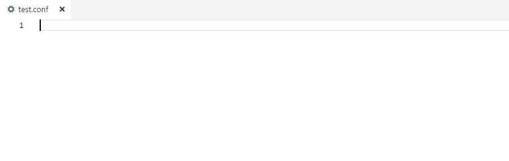
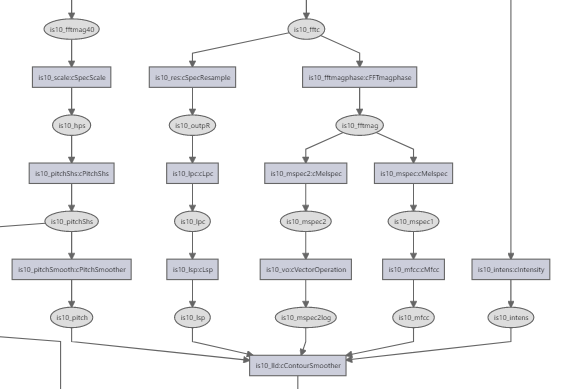

# openSMILE Config Files README

This extension adds syntax highlighting, diagnostics and IntelliSense features for openSMILE configuration files (.conf, .inc) to Visual Studio Code.

> Note: this software is not developed or officially supported by audEERING GmbH.

## Features

### Statement completion with symbol information for components, fields and levels

The component help system of openSMILE is integrated into the IDE. Completion lists are available for component types and instances, field names, field enumeration values and data memory levels.

### Navigation

* Go to definition of a component or writer of a data memory level
* Find all references (readers and writers) to data memory level

### Diagnostics 

* Errors if component types or field names are mispelled
* Errors if invalid values are assigned to fields
* Warnings if backward-compatibility options are active for components

### Graph visualization of the data flow between components

Press `Ctrl+Shift+P` and run command `openSMILE Config Files: Show component graph` to visualize the currently open configuration file as a graph. Components are depicted as rectangular nodes, data memory levels as ellipses. Edges in the graph indicate components reading from or writing to a level. Click on a component node in the graph to navigate to its location in source.

## Extension Settings

This extension can be customized using the following settings:

* `opensmile-config-files.symbolsPath`: path to a custom `symbols.json` containing symbol information

## Release Notes

### 1.0.0

Initial release.