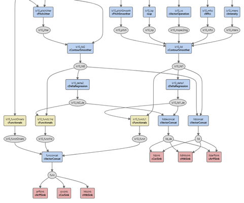

# openSMILE Config Files

This extension adds syntax highlighting, diagnostics, IntelliSense and refactoring features for openSMILE configuration files (.conf, .inc) to Visual Studio Code.

[Get this extension in the Visual Studio Marketplace](https://marketplace.visualstudio.com/items?itemName=chausner.opensmile-config-files)

## Features

### Statement completion with symbol information for components, fields and levels

The extension integrates the component help system of openSMILE right into the IDE, making it much easier to explore the functionality of openSMILE and to edit or create config files. Statement completion is available for component types and instances, field names, field enumeration values and data memory levels.

### Navigation

* Go to the definition of a component or writer of a data memory level
* Find all references (readers and writers) to a data memory level
* Open the referenced document in include directives

### Diagnostics 

* Errors if component types or field names are mispelled
* Errors if invalid values are assigned to fields
* Warnings if backward-compatibility options are active for components

### Graph visualization of the data flow between components

Open a config file and press `Ctrl+Alt+G` to visualize the data flow as a graph. Components are depicted as rectangular nodes, data memory levels as ellipses. Edges in the graph indicate components reading from or writing to a level. Click on a node in the graph to navigate to its location in source.

Uncheck the option `Show data memory levels` to obtain a simpler graph structure where data memory levels are not included as separate nodes.

## Extension Settings

This extension can be customized using the following settings:

* `opensmile-config-files.symbolsPath`: path to a custom `symbols.json` containing symbol information

## Release Notes

### 1.4.0

This release comes with updated symbol information for openSMILE 3.0.

### 1.3.0

This release introduces several new features, including support for name refactoring of component instances and levels, clickable hyperlinks for include paths, and the ability to refresh the component graph view. There is now a keyboard shortcut (Ctrl+Alt+G) for showing the component graph. Levels that have no readers or a writer associated with them are now marked in the graph, and clicking on level nodes navigates to the location where they are defined. This release also fixes issues concerning block comments and display of diagnostics, see CHANGELOG.md for details.

### 1.2.0

This release contains several features and enhancements for the component graphs. Nodes are now colored depending on the type of component (source/sink/data processor/functionals), and a new option is introduced to hide data memory levels from the graph.

### 1.1.1

This release comes with a few tweaks to the appearance of the component graphs and fixes several bugs related to graph drawing and config file parsing.

### 1.1.0

In this release, symbol information for all remaining components of openSMILE 2.3 has been added. A new diagnostic to detect mismatches between component declarations and component sections is implemented. Several bugs have been fixed. See CHANGELOG.md for details.

### 1.0.0

Initial release.